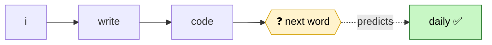
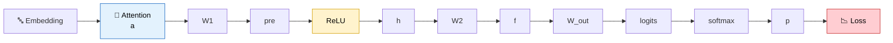
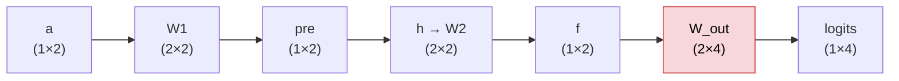
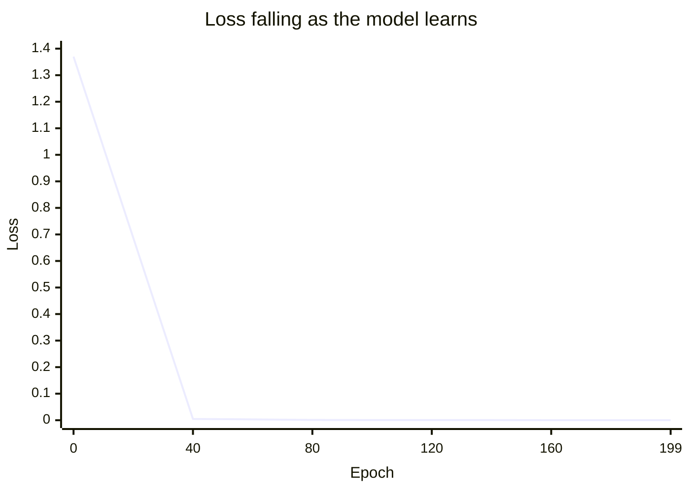

# 🧩 Mini-LLM from Scratch
> 📖 I wrote about how I built this, step by step, on Medium: [I Built the World's Smallest LLM to Prove "It's Just Matrix Multiplication"](https://medium.com/@Yash_Bhardwaj/how-i-built-the-smallest-llm-from-scratch-to-understand-matrix-multiplication-0572a2930989)

> A language model so small you can check every number by hand.

I kept reading that *"an LLM is just matrix multiplication"* and nodding along without
actually believing it. So I built the smallest possible language model I could — **4 words
in the vocabulary, 2 numbers per word** — small enough to verify every single number by
hand and finally see where the magic was hiding.

Turns out there's no magic. It's just matrices multiplying, a tiny gate in the middle,
and a loop that nudges the numbers until the answer stops being wrong.

This repo is that model, plus the notes I wish I'd had when I started.

---

## 🎯 The one example everything is built around

The model reads **`i write code`** and learns to predict the next word: **`daily`**.



One sentence, one target word. But every piece of a real transformer is in here —
embeddings, attention, a feed-forward layer, softmax, cross-entropy loss, and backprop —
just shrunk down until you can hold the whole thing in your head.

---

## 🍳 How I think about the pieces

I got tired of math-first explanations, so I picture the whole thing as a **kitchen**:

| Component | In the kitchen |
|-----------|----------------|
| 🍽️ **Embeddings** | recipe cards — turn a word into numbers the model can cook with |
| 👀 **Attention** | the chef glancing at the other ingredients before deciding |
| 🧠 **Feed-forward + ReLU** | the chef actually thinking (useless thoughts → 0) |
| ✍️ **Output layer** | the chef committing to a final guess |
| 👅 **Cross-entropy loss** | the head chef tasting it and saying how wrong it was |
| 🔁 **Backprop** | that criticism traveling back so everyone adjusts |

*If the analogy annoys you, ignore it — the code stands on its own.*

---

## 🔗 The flow, start to finish



Read it left to right: the last token's vector (`a`) goes through the feed-forward layer,
becomes scores for all 4 words (`logits`), gets squashed into probabilities (`p`), and the
loss measures how far the probability for `daily` is from 1.

---

## 📐 The thing that finally made matrix shapes click

A weight matrix is always **`(input size) × (output size)`**. Rows come from what goes in,
columns from what comes out. Nothing more.

| Weight | takes in | puts out | shape |
|--------|----------|----------|-------|
| `W1` | `a` | `pre` | **2×2** |
| `W2` | `h` | `f` | **2×2** |
| `W_out` | `f` | 4 word scores | **2×4** |

`W_out` is the only wide one because it has to score **every word** in the vocabulary.



---

## 🔍 Check it yourself

Not a black box — here's one forward pass done **by hand** with fixed weights (the real
code starts from random weights, but the arithmetic is identical):

```text
a  = [0.7, 0.9]                 # last token's vector, from attention

W1 = [[1, -2],                  # rows = input (a), columns = output (pre)
      [1,  1]]

pre[0] = 0.7*1  + 0.9*1 =  1.6
pre[1] = 0.7*-2 + 0.9*1 = -0.5
pre = [1.6, -0.5]

h = ReLU(pre) = [1.6, 0]        # -0.5 becomes 0, the gate closes

W2 = [[0.375, 0.75],
      [0.2,   0.1 ]]
f[0] = 1.6*0.375 + 0*0.2 = 0.6
f[1] = 1.6*0.75  + 0*0.1 = 1.2
f = [0.6, 1.2]

logits = [0.5, 1.0, 0.3, 2.0]   # one score per word: i, write, code, daily
p      = softmax(logits) = [0.13, 0.21, 0.10, 0.56]
Loss   = -log(p_daily) = 0.573
```

Training just repeats this and nudges the weights until `p_daily` climbs toward 1.

---

## 🚀 Running it

```bash
pip install -r requirements.txt
python 05_backprop_train.py
```

You'll watch the loss fall off a cliff:

```text
Epoch   0 | Loss=1.3736 | p(daily)=0.253
Epoch  40 | Loss=0.0049 | p(daily)=0.995
Epoch  80 | Loss=0.0013 | p(daily)=0.999
Epoch 120 | Loss=0.0007 | p(daily)=0.999
Epoch 160 | Loss=0.0004 | p(daily)=1.000
Epoch 199 | Loss=0.0003 | p(daily)=1.000

Final: {'i': 0.0, 'write': 0.0, 'code': 0.0, 'daily': 100.0}
Guess -> daily
```



The first guess is basically random (random weights — nothing is "derived", it's all
learned). By the end it's certain.

---

## 📂 What's in here

| File | What it does |
|------|--------------|
| `04_full_forward.py` | the model and one forward pass, no training. Good for poking at. |
| `05_backprop_train.py` | the training loop. This is where it actually learns. |

---

## 🗺️ Where I want to take this

- [ ] A pure NumPy version, so the autograd stops being a black box
- [ ] Predicting more than one token
- [ ] Writing out the backward-pass math by hand and checking it against PyTorch

*Open to suggestions — if you build on this or spot something I got wrong, I'd genuinely
like to hear it.*

---

## ⚠️ A fair warning

This is a toy. It memorizes one sentence. Don't point it at anything real. It exists so
that the next time someone says *"it's just matrix multiplication,"* you can say
*"yeah, I know"* — and actually mean it.

---

## 📝 License

MIT — do whatever you want with it. See [LICENSE](LICENSE).
